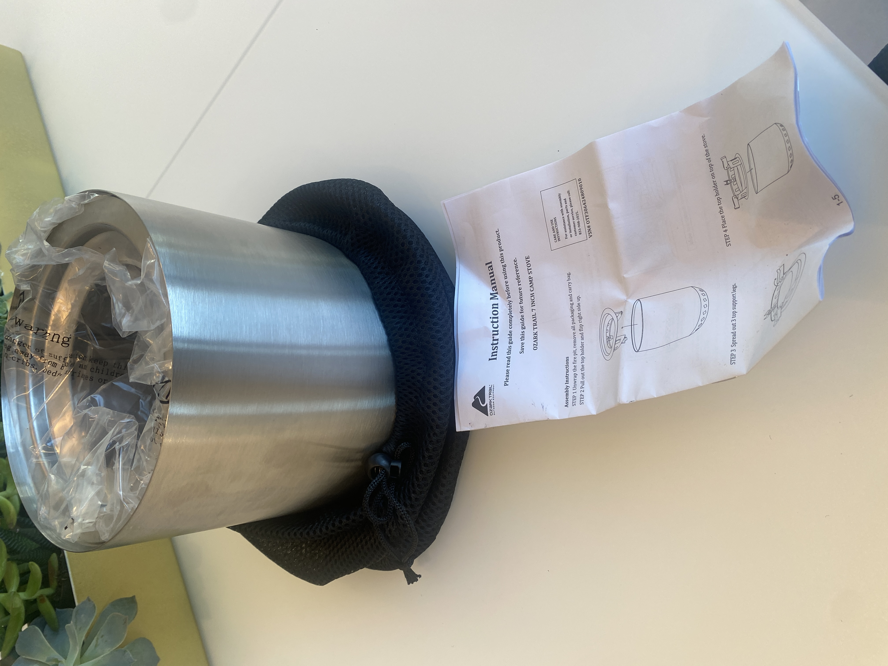
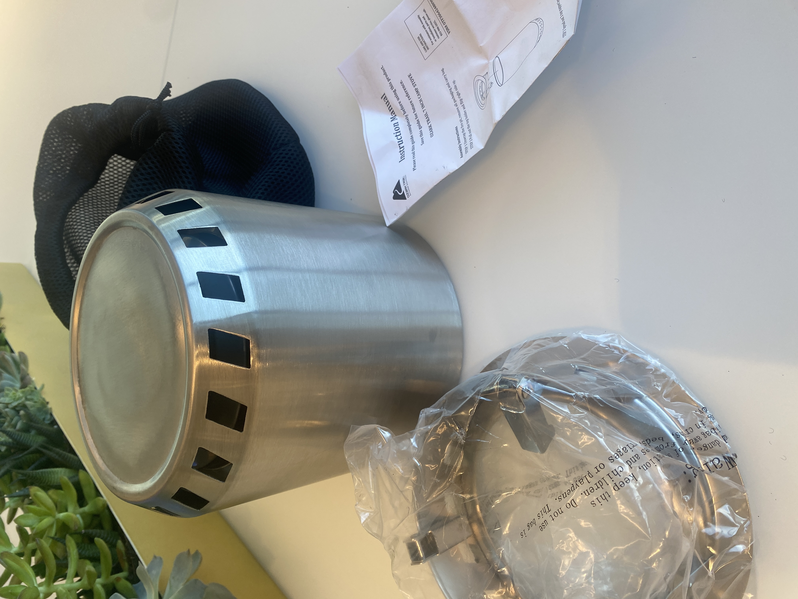
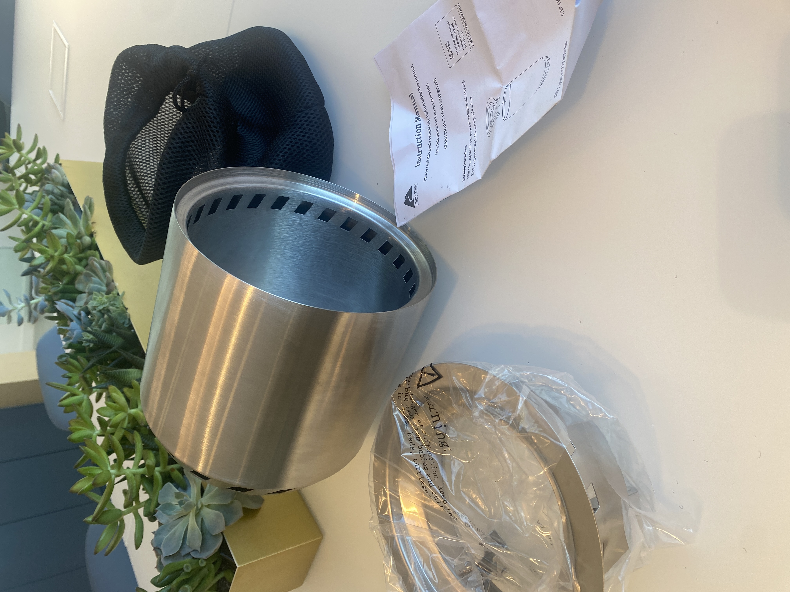
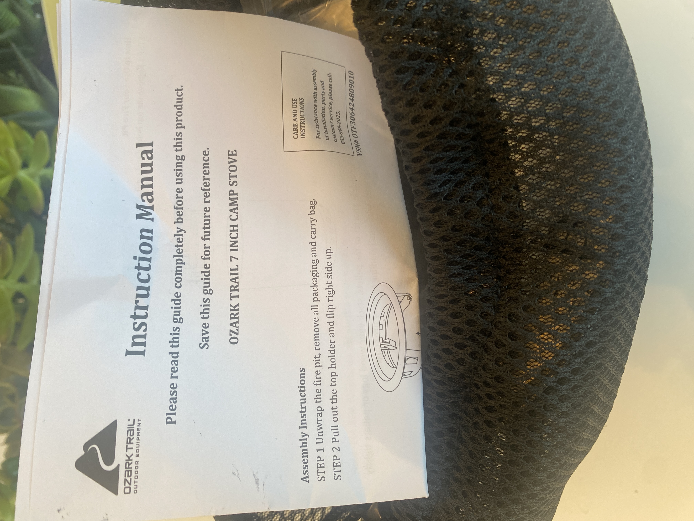
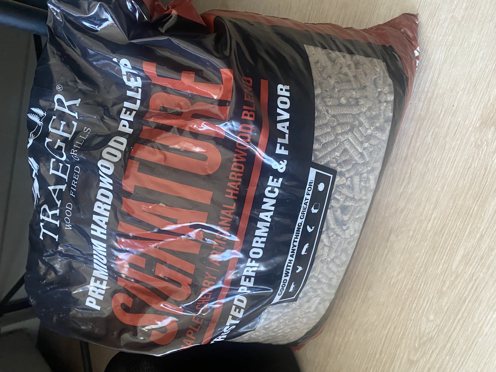
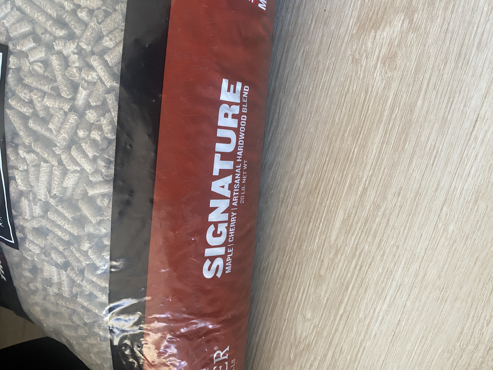

# Retail Arbitrage Manifest - 2026-02-06

> **Listing Target:** Facebook Marketplace (primary)
> **Status:** Ready for listing delegation
> **Total Items:** 2 categories

---

## Delegate Instructions

> After creating each listing, **save the URL**. When finished with all items, send ALL URLs in a single batch message. See [main instructions](../README.md#delegate-instructions).

---

<!-- ITEM:item-1-ozark-trail-camp-stove -->
## 1. Ozark Trail 7 Inch Camp Stove

### Listing Status
<!-- EXECUTION_SIGNALS:item-1-ozark-trail-camp-stove -->
| Field | Value |
|-------|-------|
| **Status** | `UNLISTED` |
| **Listing URL** | _Pending_ |
| **Platform** | — |
<!-- /EXECUTION_SIGNALS -->

### Recommended Marketplaces
- **Primary:** Facebook Marketplace
- **Also list on:** OfferUp, Craigslist

**Category:** Sports & Outdoors / Camping
**Condition:** Used - Like New
**Brand:** Ozark Trail
**Model:** 7 Inch Camp Stove

### Features
- Stainless steel construction
- Compact/portable design
- Ventilation slots for airflow
- Wood-burning camp stove
- Includes mesh carry bag
- Instruction manual included

### Key Selling Points
- Lightweight and packable
- Great for camping, hiking, backpacking
- Uses wood/twigs as fuel (no canisters needed)
- Durable stainless steel

### Images

| Preview | Description |
|---------|-------------|
|  | Stove exterior **(PRIMARY)** |
|  | Mesh carry bag |
|  | Stove with bag |
|  | With instruction manual |
|  | Components spread out |
|  | Top view showing vents |
|  | Instruction manual detail |

### Video

> **Demo video:** [IMG_3225.MOV](images/IMG_3225.MOV) - Click to download and view

### Suggested Price Range
$15 - $25

---

<!-- ITEM:item-2-traeger-signature-pellets -->
## 2. Traeger Signature Pellets

### Listing Status
<!-- EXECUTION_SIGNALS:item-2-traeger-signature-pellets -->
| Field | Value |
|-------|-------|
| **Status** | `UNLISTED` |
| **Listing URL** | _Pending_ |
| **Platform** | — |
<!-- /EXECUTION_SIGNALS -->

### Recommended Marketplaces
- **Primary:** Facebook Marketplace
- **Also list on:** OfferUp, Craigslist

**Category:** Patio & Garden / Grilling
**Condition:** New - Sealed (verify)
**Brand:** Traeger
**Model:** Signature Blend

### Specifications
- **Type:** Premium Hardwood Pellets
- **Blend:** Maple Cherry Artisanal Hardwood Blend
- **Size:** 20 lb bag (verify weight on packaging)
- **Use:** Traeger and other pellet grills/smokers

### Key Selling Points
- Premium Traeger brand
- Artisanal hardwood blend for enhanced flavor
- Works with all pellet grills
- Great for smoking meats

### Images

| Preview | Description |
|---------|-------------|
|  | Bag front - Signature branding **(PRIMARY)** |
|  | Bag side - blend details |

### Suggested Price Range
$15 - $20 (depending on local pricing)

---

## Notes for Lister

1. **Camp Stove** - Verify all components are present per instruction manual. Test fit of parts before listing.

2. **Traeger Pellets** - Check if bag is sealed/unopened. Note weight on listing.

---

*Manifest created: 2026-02-06*
*Last updated: 2026-02-08*
*Images location: `./images/`*
